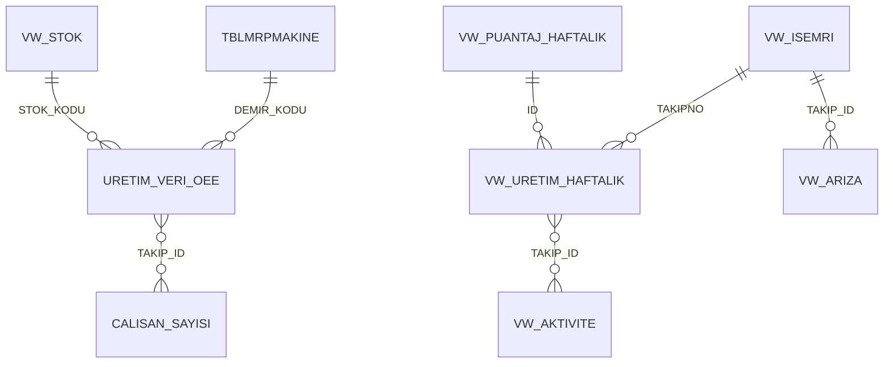

# SCADA Shop-Floor Monitor

<p align="left">
  <b>🇬🇧 English</b> · <a href="README.md">🇹🇷 Türkçe</a> ·
  <a href="../README.en.md">← portfolio home</a>
</p>

A live production monitor built **on top of the plant's own floor plan**. Every box on the
plan is a machine: the card colour is its current state (running / fault / setup / idle),
and hovering it reveals which work order it is running, how many units it has produced and
how the operators are distributed across the line. It loops on shop-floor screens with
auto-refresh, so a shift supervisor spots a stopped line at a glance.

Report labels are in Turkish, as in the original.


---

## What it answers

| Question | How the screen answers it |
|---|---|
| Which machines are running right now, which are down? | 48 machines on the floor plan with a five-state status LED |
| Why is that machine down? | Hover shows the fault name and downtime; a dedicated **Arızalar** (faults) page has the Pareto |
| How many people are on this line, in which roles? | An **SVG operator-mix strip rendered by DAX** in the tooltip (line leader / forming / QC / packing / press / shear / print) |
| How efficient is each work centre? | A gauge per station: standard time ÷ actual processing time |
| How many people are on site today? | Headcount cards per working group |

Status colours: 🟢 running · 🔴 fault/stopped · 🟡 setup · 🔵 idle (queued) · ⚫ closed / no data

---

## Pages

| Page | Content |
|---|---|
| **Üretim** (Production) | Daily output column chart, live work-in-progress table (work order, machine, setup/run/fault minutes, completion %), station efficiency gauges, daily headcount cards |
| **Zemin Kat -I** (Ground floor I) | Press hall layout: PRS-01–PRS-23 and cutting lines KSM-01–KSM-06 · 29 machine cards + LEDs |
| **Zemin Kat - II** (Ground floor II) | Printing hall: offset lines MTB-01–MTB-03 |
| **1.Kat** (First floor) | Assembly: lines MNT-01–MNT-14, digital printing DJT-01–DJT-02 |
| **Arızalar** (Faults) | Fault log table + fault-type pie + date and work-centre slicers |
| **Tooltip_Detay** | Hover detail: work order, product, machine configuration, produced vs planned, completion % and the operator-mix SVG |

> The floor plans were drawn from scratch for this repository and are **fictional**. They
> are generated from the coordinates of the report's machine cards, so the cards land
> exactly on the machine bays — but they do not depict any real facility.

---

## Data model



| Table | Grain | What it holds |
|---|---|---|
| `URETIM_VERI_OEE` | one row per machine | **The live-state table.** Work orders that moved in the last month or are still open, de-duplicated per machine. The LED colours come from here |
| `VW_DEVAM_EDEN_ISLER` | open work-order activity | Work in progress: setup/run/fault minutes, man-hours, completion |
| `VW_ISEMRI` | work order | Header: product, customer, sales order, machine, quantity, status |
| `VW_URETIM_HAFTALIK` | work-order operation | Weekly output/scrap and theoretical-vs-actual time |
| `VW_AKTIVITE` | work order × activity | Activity log (setup / run / stop), fault code, standard times |
| `VW_ARIZA` | fault record | Fault type, duration, still-open flag |
| `VW_PUANTAJ_HAFTALIK`, `VW_PUANTAJ_GUNLUK` | week / day × group | Headcount per working group |
| `TBLMRPMAKINE`, `VW_STOK` | dimension | Machine register and item master |
| `SON_GUNCELLEME` | 1 row | `DateTime.LocalNow()` — the "last updated" clock on screen |

---

## Three details worth a look

**1 · Don't let empty data invent a row.** Most machine cards would show the wrong colour
when a machine has no matching record, because Power BI materialises a blank row. The
colour measures guard against it with `COUNTROWS` — no record, `BLANK()`, card goes dark:

```dax
Renk_Olcusu =
VAR KayitSayisi = COUNTROWS('URETIM_VERI_OEE')
VAR Durumlar    = VALUES('URETIM_VERI_OEE'[ISLEM_DURUMU])
RETURN
IF( ISBLANK(KayitSayisi), BLANK(),
    SWITCH( TRUE(),
        "ARIZA/DURUŞ" IN Durumlar, "#FF0000",
        "ISLEM"       IN Durumlar, "#00FF00",
        "HAZIRLIK"    IN Durumlar, "#FFFF00",
        "PASIF"       IN Durumlar, "#00BFFF" ) )
```

**2 · SVG drawn in DAX.** The operator-mix strip in the tooltip is not a visual — it is a
`data:image/svg+xml` string produced by a measure. Only the roles actually staffed get a
box; widths and gaps are computed in DAX. This is how you get it without a custom visual.

**3 · Cards pinned to the plan.** Each machine card is bound to a single machine through a
locked visual-level filter on `TBLMRPMAKINE[DEMIR_KODU]`, while the floor plan is the page
background scaled to "Fit". That way 48 machines sit in their physical positions instead of
in a matrix.

---

## Running it

```bash
python ../tools/veri_uret.py --bugun 2026-07-30     # optional, data is committed
```

Open `SCADA Uretim Izleme.pbip` in Power BI Desktop and hit **Refresh**.
See the [root README](../README.en.md#opening-the-reports) for offline use.

> Because this screen shows "now", the synthetic data is positioned around the moment it
> was generated. Regenerate with a different `--bugun` and the live states move with it.

## Data pipeline

A simplified SQL equivalent of the tables this report reads: [`../sql/`](../sql/)

## Screenshots

| | |
|---|---|
|  |  |
| **Zemin Kat -I** — press and cutting lines | **Zemin Kat - II** — printing |
|  |  |
| **1.Kat** — assembly lines | **Arızalar** — Pareto and fault log |


**Tooltip_Detay** — work-order detail on hover, with the DAX-rendered operator-mix strip.
