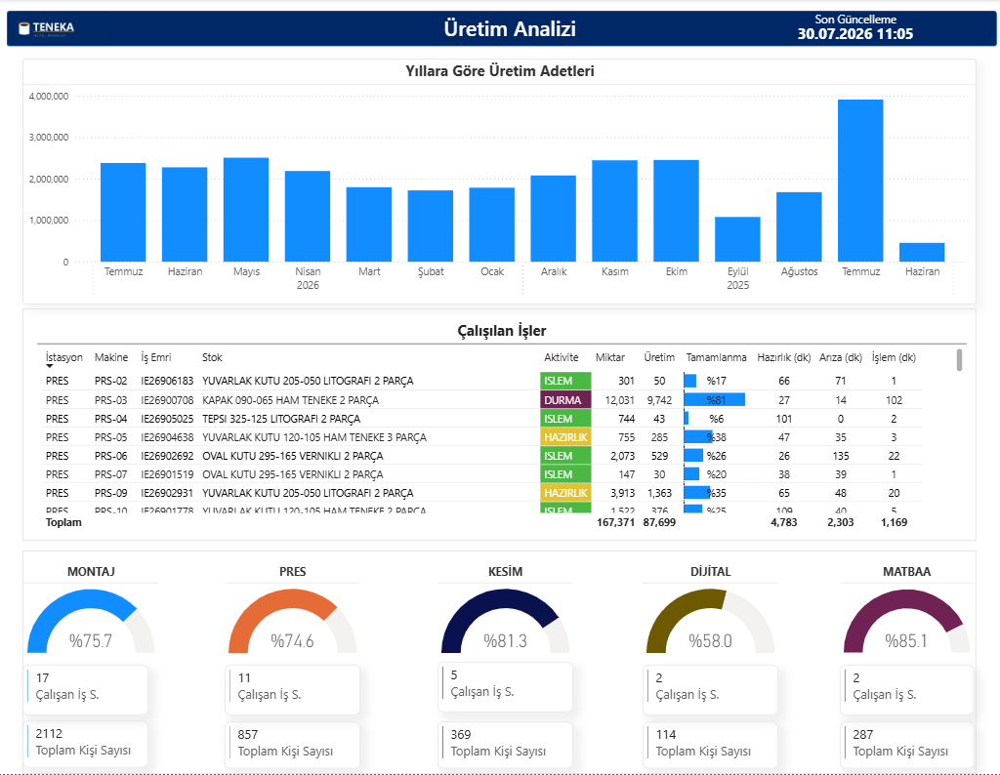
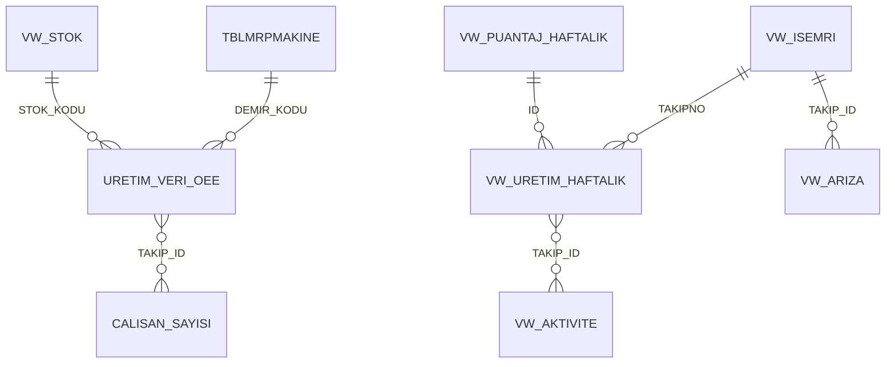
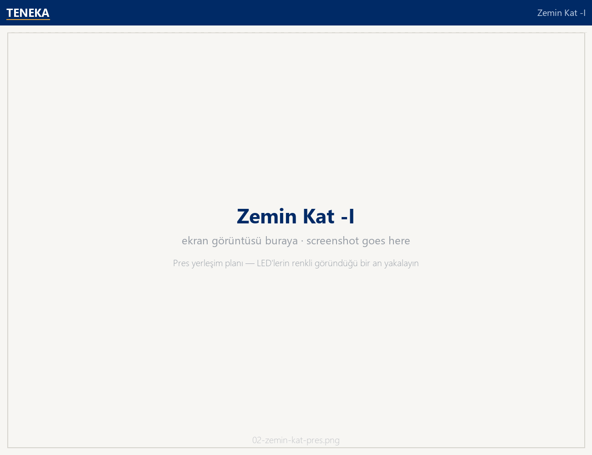
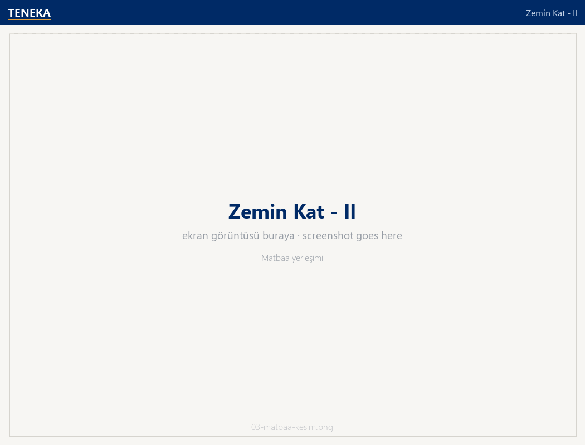
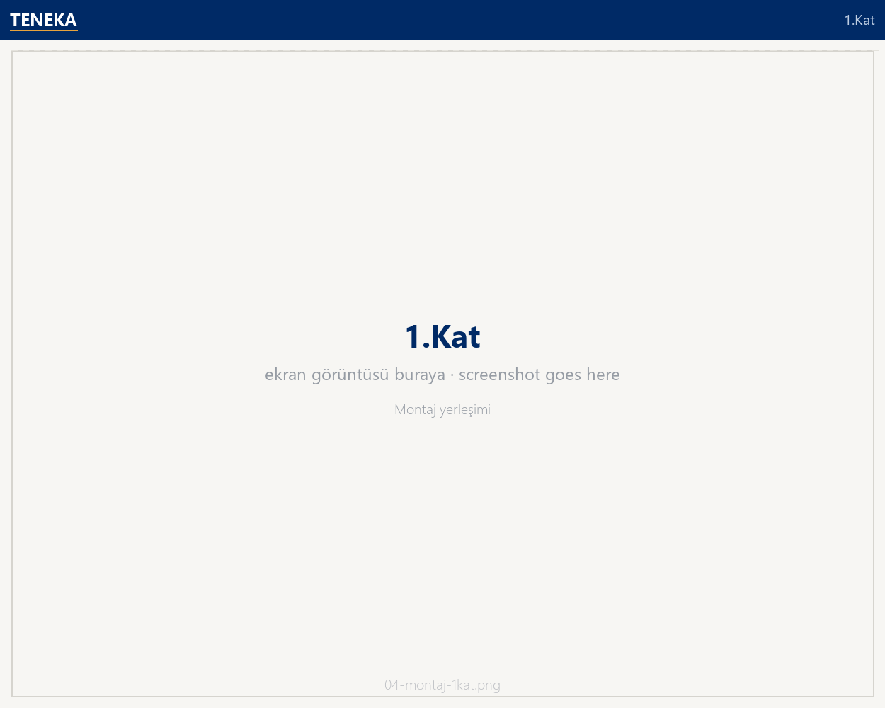
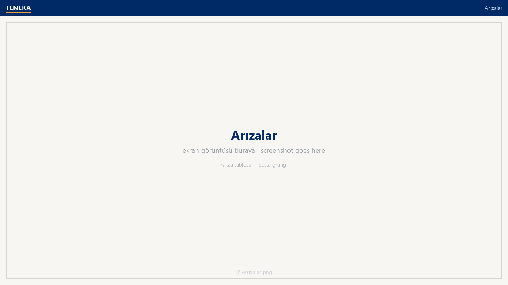
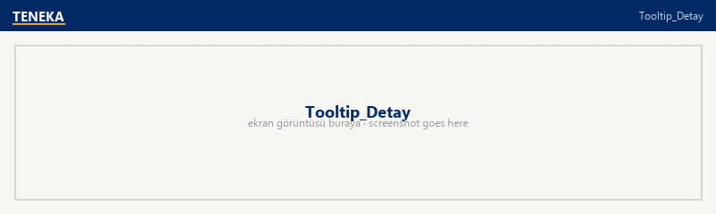

# SCADA Üretim İzleme Ekranı

<p align="left">
  <a href="README.en.md">🇬🇧 English</a> · <b>🇹🇷 Türkçe</b> ·
  <a href="../README.md">← portföy ana sayfası</a>
</p>

Fabrikanın **kendi yerleşim planı** üzerine kurulmuş canlı bir üretim takip ekranı.
Planın üstündeki her kutu bir makine: kartın rengi makinenin o andaki durumunu
(işlemde / arıza / hazırlık / pasif) gösterir, üstüne gelindiğinde hangi iş emrini
işlediği, kaç adet ürettiği ve hattaki işçi dağılımı açılır. Üretim sahasındaki
ekranlarda otomatik yenilemeyle döner; vardiya sorumlusu tek bakışta duran hattı görür.



---

## Ne çözüyor

| Soru | Ekranın cevabı |
|---|---|
| Şu an hangi makine çalışıyor, hangisi duruyor? | Yerleşim planı üzerinde 48 makine, 5 renkli durum LED'i |
| Duran makine neden duruyor? | Kart üzerine gelince arıza adı + duruş süresi; ayrı **Arızalar** sayfasında Pareto |
| Bu hatta kaç kişi çalışıyor, hangi görevlerde? | Tooltip'te DAX ile üretilmiş **SVG işçi dağılım şeridi** (bant lideri / şekillendirme / kaliteci / paketlemeci / pres / makas / baskı) |
| İstasyonların verimi ne durumda? | İstasyon başına verim göstergesi (standart süre ÷ gerçekleşen işlem süresi) |
| Sahada bugün kaç kişi var? | Puantaj kartları: çalışma grubu bazında günlük kişi sayısı |

Durum renkleri: 🟢 İşlemde · 🔴 Arıza/Duruş · 🟡 Hazırlık · 🔵 Pasif (bekliyor) · ⚫ Kapalı / veri yok

---

## Sayfalar

| Sayfa | İçerik |
|---|---|
| **Üretim** | Günlük üretim adedi kolon grafiği, devam eden işler tablosu (iş emri, makine, hazırlık/işlem/arıza dakikaları, tamamlanma %), istasyon verim göstergeleri, günlük puantaj kartları |
| **Zemin Kat -I** | Pres yerleşim planı üzerinde PRS-01–PRS-23 ve kesim hatları KSM-01–KSM-06 · 29 makine kartı + LED |
| **Zemin Kat - II** | Matbaa yerleşimi: MTB-01–MTB-03 ofset baskı hatları |
| **1.Kat** | Montaj yerleşimi: MNT-01–MNT-14 montaj hatları, DJT-01–DJT-02 dijital baskı |
| **Arızalar** | Arıza kayıtları tablosu + arıza tipi dağılım pastası + tarih ve istasyon dilimleyicileri |
| **Tooltip_Detay** | Makine kartına gelince açılan detay: iş emri, ürün, konfigürasyon, üretilen/planlanan, tamamlanma yüzdesi ve işçi dağılım SVG'si |

> Yerleşim planları bu depo için sıfırdan çizilmiş **kurgusal** planlardır. Çizimler,
> rapordaki makine kartlarının koordinatlarından üretildiği için kartlar plan üzerindeki
> makine yataklarına tam oturur — ama gerçek bir tesisi göstermezler.

---

## Veri modeli



| Tablo | Grain | Ne taşıyor |
|---|---|---|
| `URETIM_VERI_OEE` | makine × 1 satır | **Anlık durum tablosu.** Son bir ayda hareket görmüş ya da hâlâ açık iş emirlerinin makine bazında tekilleştirilmiş hâli. LED renkleri buradan gelir |
| `VW_DEVAM_EDEN_ISLER` | açık iş emri hareketi | Tezgâhtaki işler: hazırlık/işlem/arıza dakikaları, insan-saat, tamamlanma |
| `VW_ISEMRI` | iş emri | İş emri başlığı: ürün, müşteri, sipariş, makine, miktar, durum |
| `VW_URETIM_HAFTALIK` | iş emri operasyonu | Haftalık üretim/fire ve teorik-gerçekleşen süre karşılaştırması |
| `VW_AKTIVITE` | iş emri × aktivite | Aktivite kayıtları (hazırlık / işlem / durma), arıza kodu, standart süreler |
| `VW_ARIZA` | arıza kaydı | Arıza tipi, süre, devam ediyor mu |
| `VW_PUANTAJ_HAFTALIK`, `VW_PUANTAJ_GUNLUK` | hafta / gün × grup | Çalışma grubu bazında kişi sayısı |
| `TBLMRPMAKINE`, `VW_STOK` | boyut | Makine parkı ve stok kartları |
| `SON_GUNCELLEME` | 1 satır | `DateTime.LocalNow()` — ekrandaki "son güncelleme" saati |

---

## Öne çıkan üç teknik ayrıntı

**1 · Boş veri sahte satır üretmesin.** Makine kartlarının çoğu, o makineye ait kayıt
olmadığında Power BI'ın boş satır üretmesi yüzünden yanlış renk gösterir. Renk ölçüleri
bunu `COUNTROWS` kontrolüyle çözüyor — kayıt yoksa `BLANK()` döner, kart kararır:

```dax
Renk_Olcusu =
VAR KayitSayisi = COUNTROWS('URETIM_VERI_OEE')
VAR Durumlar    = VALUES('URETIM_VERI_OEE'[ISLEM_DURUMU])
RETURN
IF( ISBLANK(KayitSayisi), BLANK(),
    SWITCH( TRUE(),
        "ARIZA/DURUŞ" IN Durumlar, "#FF0000",
        "ISLEM"       IN Durumlar, "#00FF00",
        "HAZIRLIK"    IN Durumlar, "#FFFF00",
        "PASIF"       IN Durumlar, "#00BFFF" ) )
```

**2 · DAX ile SVG çizimi.** Tooltip'teki işçi dağılım şeridi bir görsel değil, ölçünün
ürettiği `data:image/svg+xml` dizesi. Sekiz görev için sadece dolu olanlar çiziliyor,
kutu genişlikleri ve boşluklar DAX'ta hesaplanıyor. Özel görsel (custom visual)
kullanmadan bunu yapmanın yolu bu.

**3 · Kartlar plan üzerinde sabit.** Her makine kartı, `TBLMRPMAKINE[DEMIR_KODU]`
üzerine kilitli bir görsel düzeyi filtresiyle tek bir makineye bağlı; arka plan
görseli olarak yerleşim planı "Fit" ölçekleniyor. Böylece 48 makine, tek bir matris
görseli yerine plan üzerinde fiziksel yerinde durur.

---

## Nasıl açılır

```bash
python ../tools/veri_uret.py --bugun 2026-07-30     # veri (isteğe bağlı, repoda hazır)
```

`SCADA Uretim Izleme.pbip` dosyasını Power BI Desktop ile açın, **Yenile**'ye basın.
Ayrıntı ve çevrimdışı kullanım için [ana README](../README.md#nasıl-açılır).

> Bu ekran "şu an"ı gösterdiği için sentetik veri, üretildiği ana göre konumlanır.
> `--bugun` parametresini değiştirip yeniden üretirseniz anlık durumlar da güncellenir.

## Veri hattı

Raporun okuduğu tabloların sadeleştirilmiş SQL karşılığı: [`../sql/`](../sql/)

## Ekran görüntüleri

| | |
|---|---|
|  |  |
| **Zemin Kat -I** — pres ve kesim hatları | **Zemin Kat - II** — matbaa |
|  |  |
| **1.Kat** — montaj hatları | **Arızalar** — Pareto ve kayıt listesi |



**Tooltip_Detay** — makine kartına gelince açılan iş emri detayı ve DAX ile üretilmiş işçi dağılım şeridi.
