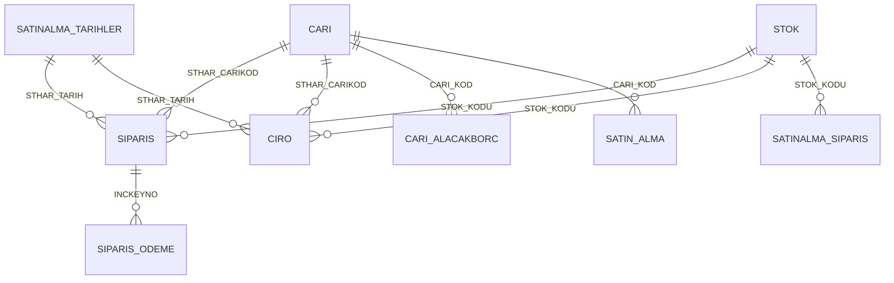

# Domestic Sales Analytics

<p align="left">
  <b>🇬🇧 English</b> · <a href="README.md">🇹🇷 Türkçe</a> ·
  <a href="../README.en.md">← portfolio home</a>
</p>

The shared reporting template for the commercial departments. Pick a customer and its whole
story lands on one page — first order to last, open order value, outstanding balance. The
revenue page puts the selected period next to the same period last year across four
dimensions (revenue, customer count, mould variety, units). Most of the **84 DAX measures**
feed that YTD/LYTD comparison set and the customer/mould breakdowns.

This is the domestic version; the export and printed-from-stock reports are copies of the same template
with the department filter swapped. Report labels are in Turkish, as in the original.


---

## What it answers

| Question | Page |
|---|---|
| How many orders this month, worth how much, how many still open? | Sipariş & Müşteri (Orders & customers) |
| Where is revenue vs last year — is growth from more customers or bigger baskets? | Ciro (Revenue, YTD vs LYTD, 4 KPIs) |
| How long since this customer last ordered, and what do they owe us? | Cari (Account) |
| Which mould generates how much revenue, and what is the price per can? | Kalıp (Mould) |
| How is the split across quarters and half-years? | Çeyrekler (Quarters) |
| Where is the receivable/payable balance going wrong? | Alacak - Borç (Receivables/payables) |

---

## Pages

| Page | Content |
|---|---|
| **Sipariş & Müşteri** | 5 KPI cards (value, order count, average value, customer count, open order value), monthly value + order-count combo chart, new-vs-existing customer split, advance-vs-term payment mix |
| **Sipariş Detayları** | Order-line matrix: customer, FX rate, status and five free-text fields (lid type, units per case, material, packing, note) |
| **Cari** | Single-customer card: first/last order date, days since last order, order count, open orders, receivable–payable; plus a year × period sales matrix and mould ranking |
| **Alacak - Borç** | Receivable vs payable balances per customer, table broken down by sales rep |
| **Ciro** | A 4 × 3 KPI grid (selected period / prior period / growth text), monthly revenue column+line, customer pie, mould bar chart, sector treemap |
| **Kalıp** | Mould × account × revenue matrix with a **revenue-per-can** measure |
| **Çeyrekler** | Year × quarter / half-year matrix; which breakdown appears is driven by the `MatrixSatisGruplari` table |
| **TT_Musteri_Siparis** | Tooltip page for the new/existing-customer visuals |

---

## Data model

A classic star: two fact tables (`SIPARIS` order lines, `CIRO` invoice lines) share the
`STOK`, `CARI` and date dimensions. The payment schedule hangs off the order line, the
balance off the customer.



| Table | Grain | Note |
|---|---|---|
| `SIPARIS` | order line | Quantity, unit price, shipped/remaining, payment terms, nth-order counter (the new-vs-existing customer split comes from here) |
| `CIRO` | invoice line | Shipped quantity and USD value; links back to the order via `STHAR_SIPNUM` |
| `SIPARIS_ODEME` | order line × instalment | Advance/term schedule, gross and net amounts |
| `CARI_ALACAKBORC` | customer | End-of-day receivable/payable balance, FX rate and USD equivalent |
| `SATINALMA_TARIHLER` | day | 2012–2030 calendar; month/quarter/half-year columns are calculated |
| `MatrixSatisGruplari` | 1 column | Helper table (inline data) selecting which period breakdown the matrix shows |

---

## Three details worth a look

**1 · The YTD/LYTD comparison set.** The same pattern repeats for four metrics (revenue,
customer count, mould count, units): a `..._YTD_Core` base measure, a `..._LYTD` for the
same period last year, a growth percentage, and a **KPI text** measure with the arrow baked
in. The cards show the text rather than the number, which removes the need for conditional
formatting.

**2 · A measure-driven matrix.** `Matrix Satis Degeri` returns a different calculation
depending on the `MatrixSatisGruplari[Grup]` value in row context:

```dax
Matrix Satis Degeri =
VAR SeciliGrup = SELECTEDVALUE ( 'MatrixSatisGruplari'[Grup] )
RETURN
    SWITCH ( TRUE (),
        SeciliGrup = "Toplam",          [OLC_SIPARIS_TOPLAMTUTAR],
        SeciliGrup = "Aylık Ortalama",  AVERAGEX ( VALUES ( 'SATINALMA_TARIHLER'[AyNo] ), [OLC_SIPARIS_TOPLAMTUTAR] ),
        SeciliGrup = "Çeyrek 1",        CALCULATE ( [OLC_SIPARIS_TOPLAMTUTAR], 'SATINALMA_TARIHLER'[CeyrekNo] = 1 ),
        ...
    )
```

That is how "total / quarters / half-years / monthly average" rows sit in a single matrix
instead of four separate visuals.

**3 · "New customer" is defined in the data, not the measure.** Rows where
`KACINCI_SIPARIS = 1` count as a new customer, and the `Musteri Tipi` calculated column
labels them. The new-customer contribution measure is then a single `CALCULATE`, and the
label works as a slicer.

---

## Running it

Open `Yurtici Ticaret Analizi.pbip` in Power BI Desktop and hit **Refresh**.
Details in the [root README](../README.en.md#opening-the-reports).

## Data pipeline

A simplified SQL equivalent of the tables this report reads: [`../sql/`](../sql/)

## Screenshots

| | |
|---|---|
|  |  |
| **Ciro** — YTD vs LYTD KPI grid | **Cari** — single customer profile |
|  |  |
| **Alacak - Borç** | **Kalıp** — revenue per can |
|  |  |
| **Çeyrekler** — measure-driven matrix | **Sipariş Detayları** |
