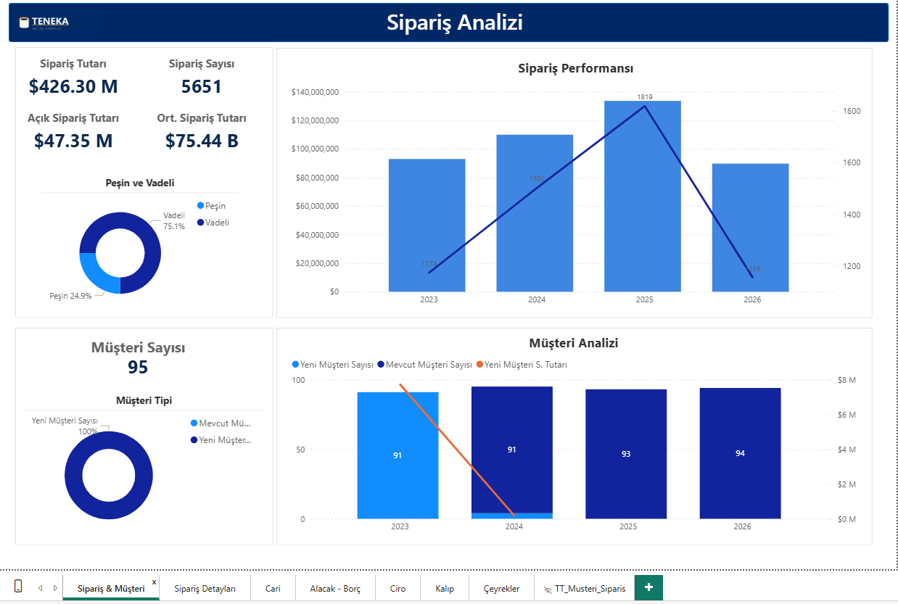
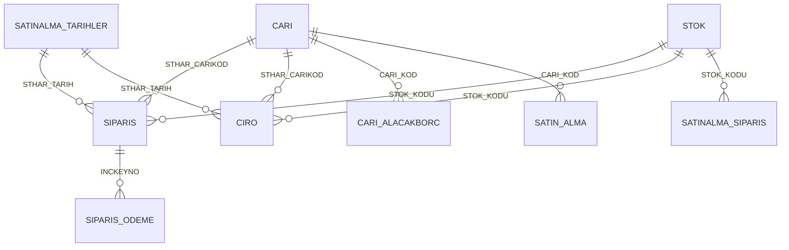
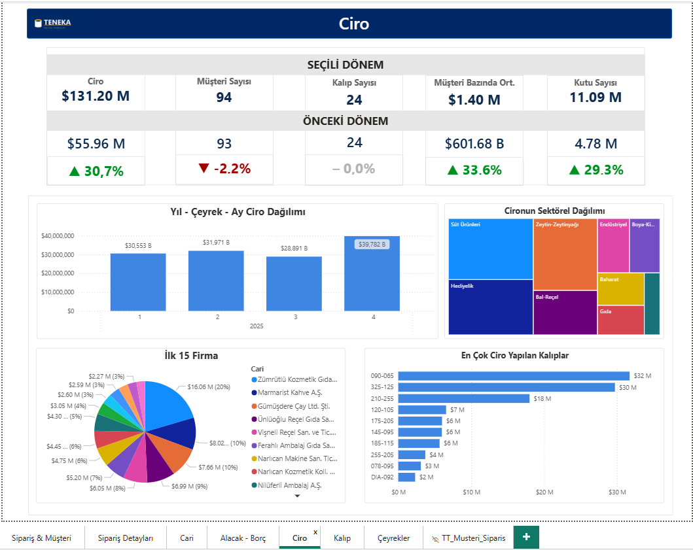
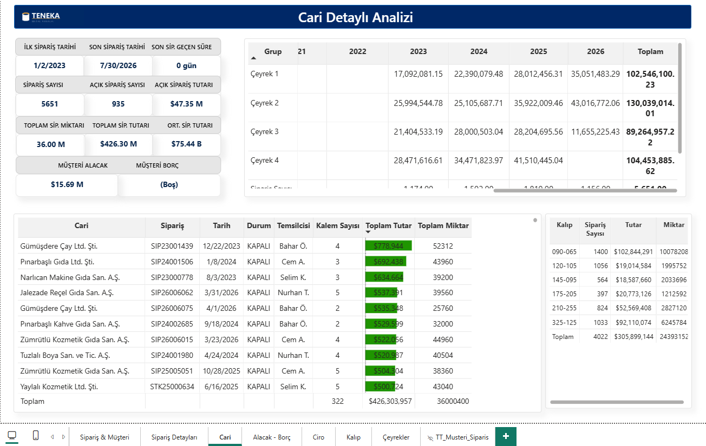
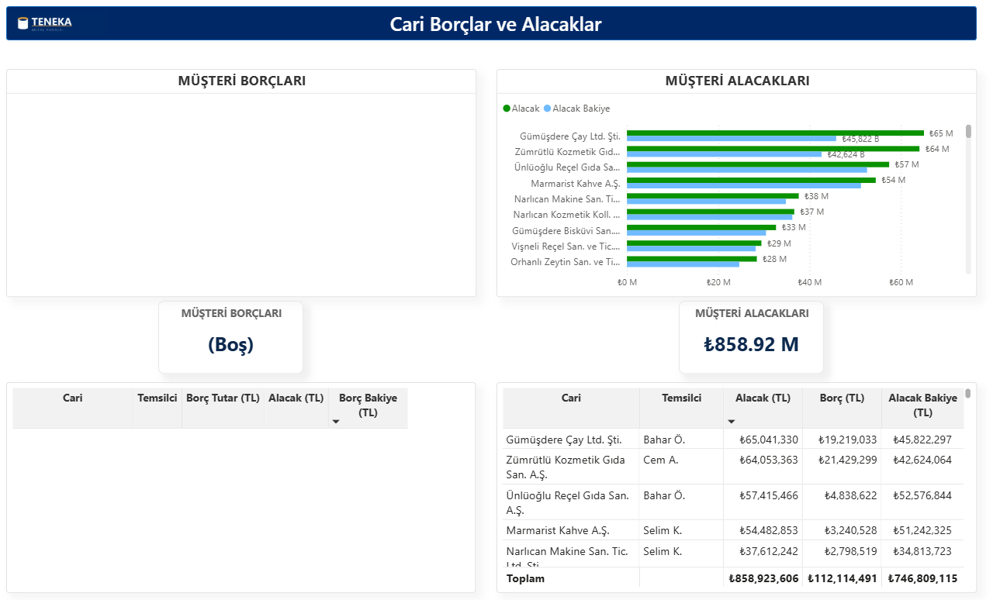
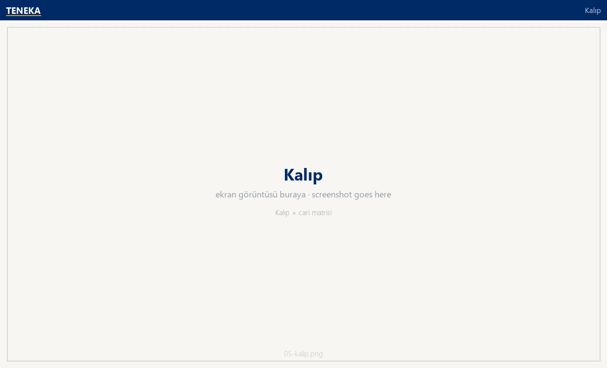
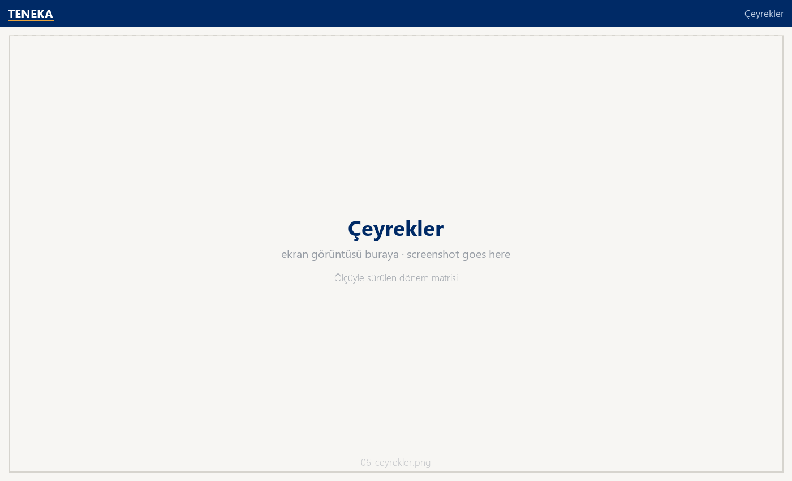
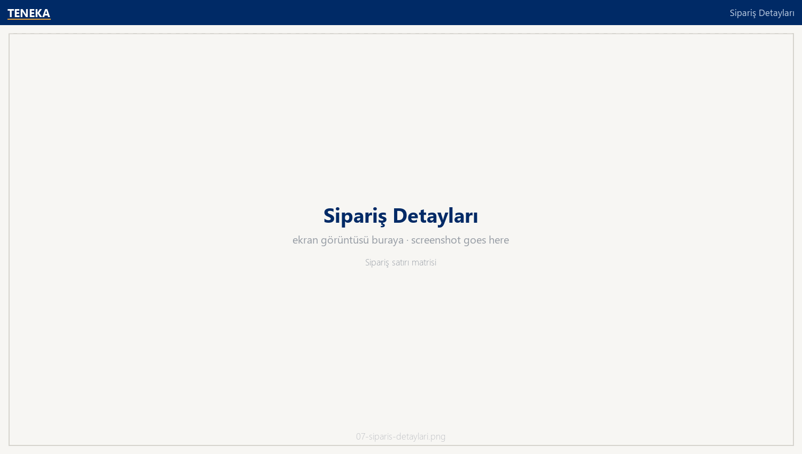

# Yurtiçi Ticaret Analizi

<p align="left">
  <a href="README.en.md">🇬🇧 English</a> · <b>🇹🇷 Türkçe</b> ·
  <a href="../README.md">← portföy ana sayfası</a>
</p>

Ticaret departmanlarının ortak rapor şablonu. Bir müşteriyi seçtiğinizde ilk siparişinden
son siparişine, açık sipariş tutarından cari bakiyesine kadar tüm hikâyesi tek sayfada
çıkıyor; ciro sayfası ise seçili dönemi geçen yılın aynı dönemiyle dört boyutta (ciro,
müşteri sayısı, kalıp çeşidi, adet) yan yana koyuyor. **84 DAX ölçüsünün** çoğu bu
YTD/LYTD karşılaştırma setini ve müşteri-kalıp kırılımlarını besliyor.

Bu dosya yurtiçi versiyonu; yurtdışı ve baskılı satış raporları aynı şablonun departman filtresi
değiştirilmiş kopyalarıdır.



---

## Ne çözüyor

| Soru | Sayfa |
|---|---|
| Bu ay kaç sipariş aldık, ne kadar tuttu, kaçı hâlâ açık? | Sipariş & Müşteri |
| Ciro geçen yıla göre nerede? Büyüme müşteri sayısından mı, sepet büyüklüğünden mi geliyor? | Ciro (YTD vs LYTD, 4 KPI) |
| Bu müşteri ne zamandır sipariş vermiyor, bize ne kadar borcu var? | Cari |
| Hangi kalıptan ne kadar ciro çıkıyor, kutu başına fiyat ne? | Kalıp |
| Çeyrekler arası dağılım nasıl, yarıyıl bazında kim büyüdü? | Çeyrekler |
| Alacak/borç dengesi hangi müşterilerde bozuluyor? | Alacak - Borç |

---

## Sayfalar

| Sayfa | İçerik |
|---|---|
| **Sipariş & Müşteri** | 5 KPI kartı (tutar, sipariş sayısı, ortalama tutar, müşteri sayısı, açık sipariş tutarı), aylık tutar + sipariş sayısı kombo grafiği, yeni/mevcut müşteri kırılımı, peşin–vadeli dağılımı |
| **Sipariş Detayları** | Sipariş satırı matrisi: müşteri, kur, durum ve beş serbest açıklama alanı (kapak tipi, koli adedi, malzeme, paketleme, not) |
| **Cari** | Tek müşteri kartı: ilk/son sipariş tarihi, son siparişten geçen gün, sipariş sayısı, açık sipariş, alacak–borç; yanında yıl × dönem satış matrisi ve kalıp sıralaması |
| **Alacak - Borç** | Alacak ve borç bakiyelerinin müşteri bazında karşılaştırması, temsilci kırılımlı tablo |
| **Ciro** | 4 × 3 KPI ızgarası (seçili dönem / önceki dönem / büyüme metni), aylık ciro kolon+çizgi, müşteri pastası, kalıp bar grafiği, sektör treemap'i |
| **Kalıp** | Kalıp × cari × ciro matrisi ve **kutu başı ciro** ölçüsü |
| **Çeyrekler** | Yıl × çeyrek / yarıyıl matrisi; hangi grubun gösterileceğini `MatrixSatisGruplari` tablosu belirler |
| **TT_Musteri_Siparis** | Yeni/mevcut müşteri görsellerinde açılan tooltip sayfası |

---

## Veri modeli

Klasik yıldız: iki olgu tablosu (`SIPARIS` sipariş satırları, `CIRO` fatura satırları) ortak
`STOK`, `CARI` ve tarih boyutlarını paylaşır. Ödeme planı sipariş satırına, cari bakiye
müşteriye bağlanır.



| Tablo | Grain | Not |
|---|---|---|
| `SIPARIS` | sipariş satırı | Miktar, birim fiyat, gönderilen/kalan, ödeme koşulu, kaçıncı sipariş (yeni/mevcut müşteri ayrımı buradan) |
| `CIRO` | fatura satırı | Sevk edilen miktar ve USD tutar; `STHAR_SIPNUM` ile siparişe geri bağlanır |
| `SIPARIS_ODEME` | sipariş satırı × taksit | Peşinat/vade planı, KDV'li ve net tutarlar |
| `CARI_ALACAKBORC` | müşteri | Gün sonu alacak/borç bakiyesi, kur ve USD karşılığı |
| `SATINALMA_TARIHLER` | gün | 2012–2030 takvim; ay/çeyrek/yarıyıl kolonları hesaplanmış |
| `MatrixSatisGruplari` | 1 kolon | Matriste hangi dönem kırılımının gösterileceğini seçen yardımcı tablo (satır içi veri) |

---

## Öne çıkan üç teknik ayrıntı

**1 · YTD/LYTD karşılaştırma seti.** Dört metrik (ciro, müşteri sayısı, kalıp sayısı, adet)
için aynı kalıp tekrarlanıyor: `..._YTD_Core` çekirdek ölçüsü, `..._LYTD` geçen yıl aynı
dönem, büyüme yüzdesi ve okla birlikte bir **KPI metni** ölçüsü. Kartlar yüzdeyi değil
metni gösterdiği için koşullu biçimlendirmeye gerek kalmıyor.

**2 · Ölçüyle sürülen matris.** `Matrix Satis Degeri`, satır bağlamındaki
`MatrixSatisGruplari[Grup]` değerine göre farklı bir hesap döndürüyor:

```dax
Matrix Satis Degeri =
VAR SeciliGrup = SELECTEDVALUE ( 'MatrixSatisGruplari'[Grup] )
RETURN
    SWITCH ( TRUE (),
        SeciliGrup = "Toplam",          [OLC_SIPARIS_TOPLAMTUTAR],
        SeciliGrup = "Aylık Ortalama",  AVERAGEX ( VALUES ( 'SATINALMA_TARIHLER'[AyNo] ), [OLC_SIPARIS_TOPLAMTUTAR] ),
        SeciliGrup = "Çeyrek 1",        CALCULATE ( [OLC_SIPARIS_TOPLAMTUTAR], 'SATINALMA_TARIHLER'[CeyrekNo] = 1 ),
        ...
    )
```

Tek matriste "toplam / çeyrekler / yarıyıllar / aylık ortalama" satırlarını yan yana
getirmenin yolu bu — dört ayrı görsel yerine bir tane.

**3 · Yeni müşteri tanımı veride, ölçüde değil.** `KACINCI_SIPARIS = 1` olan satırlar yeni
müşteri sayılıyor; `Musteri Tipi` hesaplanmış kolonu bunu etiketliyor. Böylece "yeni müşteri
katkısı" ölçüsü tek `CALCULATE` ile yazılabiliyor ve dilimleyicide filtre olarak kullanılabiliyor.

---

## Nasıl açılır

`Yurtici Ticaret Analizi.pbip` dosyasını Power BI Desktop ile açın, **Yenile**'ye basın.
Ayrıntı: [ana README](../README.md#nasıl-açılır).

## Veri hattı

Raporun okuduğu tabloların sadeleştirilmiş SQL karşılığı: [`../sql/`](../sql/)

## Ekran görüntüleri

| | |
|---|---|
|  |  |
| **Ciro** — YTD vs LYTD KPI ızgarası | **Cari** — tek müşteri profili |
|  |  |
| **Alacak - Borç** | **Kalıp** — kutu başı ciro |
|  |  |
| **Çeyrekler** — ölçüyle sürülen matris | **Sipariş Detayları** |
