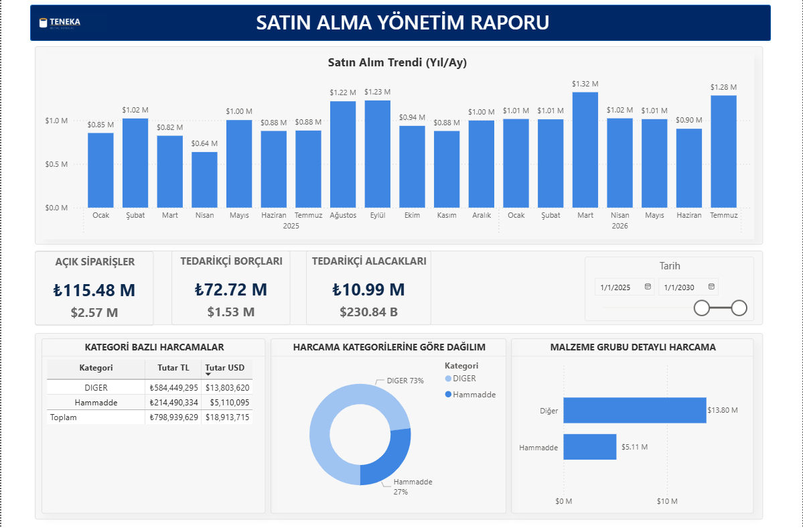
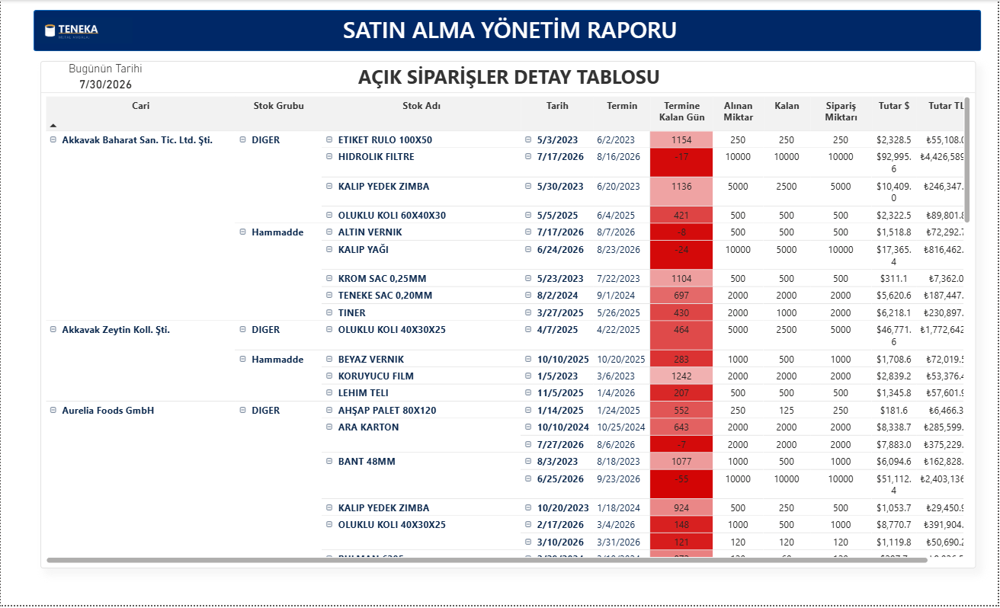
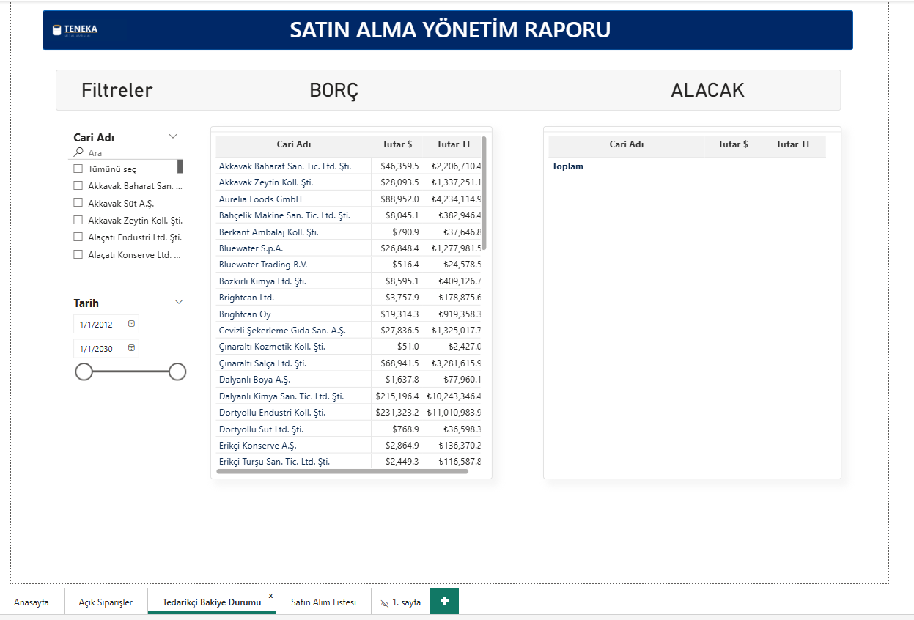
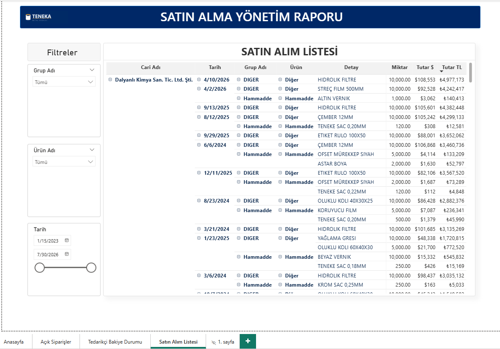
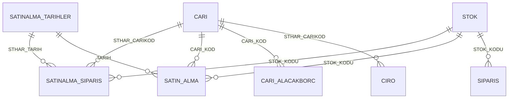

# Procurement Analytics

<p align="left">
  <b>🇬🇧 English</b> · <a href="README.md">🇹🇷 Türkçe</a> ·
  <a href="../README.en.md">← portfolio home</a>
</p>

A one-page status report for procurement management, with three detail pages behind it. Open
order value, supplier payable/receivable balance and **due-date slippage** sit on the same
screen: how much of each material was ordered, how much arrived, and how many days past due
the remainder is. Amounts appear in both TRY and USD, because imported items are priced in
foreign currency while the budget is tracked in lira.

Report labels are in Turkish, as in the original.



---

## What it answers

| Question | Page |
|---|---|
| What is our total open-order exposure (TRY and USD)? | Anasayfa (Home) — 6 KPI cards |
| How much did we buy this month, in which material group? | Anasayfa — monthly column + group donut |
| Which orders are past due, and how much is still missing? | Açık Siparişler (Open orders) |
| What do we owe suppliers, and who owes us? | Tedarikçi Bakiye Durumu (Supplier balances) |
| Who did we buy this material from, at what price, and when? | Satın Alım Listesi (Purchase list) |

---

## Pages

| Page | Content |
|---|---|
| **Anasayfa** | 6 KPI cards (open orders TRY/USD, supplier receivables TRY/USD, supplier payables TRY/USD), monthly purchase column chart, horizontal bar by material type, stock-group donut and a TRY/USD summary table; date slicer on top |
| **Açık Siparişler** | Order-line matrix: supplier, item, ordered, received, remaining, due date and **days to due**; today's date as a card |
| **Tedarikçi Bakiye Durumu** | Payable and receivable matrices side by side with account and date slicers |
| **Satın Alım Listesi** | Actual goods receipts: date, supplier, material, quantity, TRY/USD value; group and type slicers |

---

## Screenshots

| | |
|---|---|
|  |  |
| **Açık Siparişler** — days to due | **Tedarikçi Bakiye Durumu** |



**Satın Alım Listesi** — actual goods receipts.

---

## Data model

Purchase orders (`SATINALMA_SIPARIS`) and actual receipts (`SATIN_ALMA`) are two separate
fact tables sharing the `STOK`, `CARI` and calendar dimensions — so "what I ordered" and
"what arrived" can be compared on the same breakdown.



| Table | Grain | Note |
|---|---|---|
| `SATINALMA_SIPARIS` | purchase order line | Ordered/received/remaining quantity, due date, days elapsed and days to due, import-vs-domestic flag, open/closed status |
| `SATIN_ALMA` | goods receipt line | Actual inbound: quantity, net price, payment days, description |
| `CARI_ALACAKBORC` | account | End-of-day balance; the `CARI_TIPI` calculated column separates suppliers from customers |
| `CARI`, `STOK` | dimension | Supplier and material master |
| `SATINALMA_TARIHLER` | day | 2012–2030 calendar |

The sales-side tables (`SIPARIS`, `CIRO`) are also present, so purchases can be expressed as
a share of revenue from the same model.

---

## Three details worth a look

**1 · TRY and USD are calculated separately, never converted.** The USD value is stored in
the data; the TRY value is computed per row as quantity × unit price with `SUMX`. Converting
a total at one rate would be wrong when the rate moved during the period:

```dax
OLC_SATSIP_TUTAR_TL =
SUMX ( SATINALMA_SIPARIS, SATINALMA_SIPARIS[STHAR_GCMIK] * SATINALMA_SIPARIS[STHAR_NF] )
```

**2 · Slippage is flipped so it reads naturally.** A negative `TERMINE_KALAN_GUN` means the
order is late; the sign is inverted so the matrix reads "12 days late" instead of "−12 days",
while blanks stay blank:

```dax
Termine Kalan Gün (Düz) =
IF ( ISBLANK ( SATINALMA_SIPARIS[TERMINE_KALAN_GUN] ), BLANK (), - SATINALMA_SIPARIS[TERMINE_KALAN_GUN] )
```

**3 · The supplier filter lives inside the measure.** Because the account table holds both
customers and suppliers, the KPI cards carry `CARI[CARI_TIPI] = "TEDARIKCI"` in the measure
rather than relying on a report filter — the card returns the same number on any page.

---

## Data pipeline

A simplified SQL equivalent of the tables this report reads: [`../sql/`](../sql/)

---

## Running it

Open `Satin Alma Analizi.pbip` in Power BI Desktop and hit **Refresh**.
Details in the [root README](../README.en.md#opening-the-reports).

