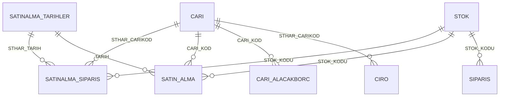

# Satın Alma Analizi

<p align="left">
  <a href="README.en.md">🇬🇧 English</a> · <b>🇹🇷 Türkçe</b> ·
  <a href="../README.md">← portföy ana sayfası</a>
</p>

Satın alma yönetimi için tek sayfalık bir durum raporu ve arkasındaki üç detay sayfası.
Açık sipariş tutarı, tedarikçi borç/alacak dengesi ve **termin gecikmesi** aynı ekranda:
hangi malzemenin ne kadarı sipariş edildi, ne kadarı geldi, kalan miktarın termini kaç gün
geçti. Tutarlar hem TL hem USD gösteriliyor, çünkü ithal kalemlerin fiyatı dövizle
sabitlenirken bütçe TL üzerinden takip ediliyor.


---

## Ne çözüyor

| Soru | Sayfa |
|---|---|
| Açık siparişlerimizin toplam yükü ne (TL ve USD)? | Anasayfa — 6 KPI kartı |
| Bu ay ne kadar mal aldık, hangi malzeme grubuna? | Anasayfa — aylık kolon + grup donut'u |
| Hangi siparişin termini geçti, ne kadarı hâlâ gelmedi? | Açık Siparişler |
| Tedarikçilere ne kadar borcumuz var, kimden alacaklıyız? | Tedarikçi Bakiye Durumu |
| Bir malzemeyi kimden, ne fiyata, hangi tarihte aldık? | Satın Alım Listesi |

---

## Sayfalar

| Sayfa | İçerik |
|---|---|
| **Anasayfa** | 6 KPI kartı (açık sipariş TL/USD, tedarikçi alacak TL/USD, tedarikçi borç TL/USD), aylık satın alma kolon grafiği, malzeme türüne göre yatay bar, stok grubu donut'u ve TL/USD özet tablosu; üstte tarih dilimleyici |
| **Açık Siparişler** | Sipariş satırı matrisi: tedarikçi, stok, sipariş miktarı, alınan, kalan, termin ve **termine kalan gün**; bugünün tarihi kart olarak |
| **Tedarikçi Bakiye Durumu** | Borç ve alacak matrisleri yan yana, cari ve tarih dilimleyicileriyle |
| **Satın Alım Listesi** | Gerçekleşen mal kabullerin listesi: tarih, tedarikçi, malzeme, miktar, TL/USD tutar; grup ve tür dilimleyicileri |

---

## Ekran görüntüleri

| | |
|---|---|
|  |  |
| **Açık Siparişler** — termine kalan gün | **Tedarikçi Bakiye Durumu** |


**Satın Alım Listesi** — gerçekleşen mal kabuller.

---

## Veri modeli

Sipariş (`SATINALMA_SIPARIS`) ve gerçekleşen alım (`SATIN_ALMA`) iki ayrı olgu tablosu;
ikisi de `STOK`, `CARI` ve takvim boyutlarını paylaşıyor. Böylece "sipariş ettiğim" ile
"eline geçen" aynı kırılımda karşılaştırılabiliyor.



| Tablo | Grain | Not |
|---|---|---|
| `SATINALMA_SIPARIS` | satın alma sipariş satırı | Sipariş/alınan/kalan miktar, termin, terminden geçen ve termine kalan gün, ithal-yerli ayrımı, ACIK/KAPALI durum |
| `SATIN_ALMA` | mal kabul satırı | Fiili giriş: miktar, net fiyat, ödeme günü, açıklama |
| `CARI_ALACAKBORC` | cari | Gün sonu bakiyesi; `CARI_TIPI` hesaplanmış kolonu ile tedarikçi/müşteri ayrımı |
| `CARI`, `STOK` | boyut | Tedarikçi ve malzeme kartları |
| `SATINALMA_TARIHLER` | gün | 2012–2030 takvim |

Raporda ayrıca satış tarafı tabloları (`SIPARIS`, `CIRO`) duruyor: satın almayı ciroya
oranlamak gerektiğinde aynı modelden çalışılabiliyor.

---

## Öne çıkan üç teknik ayrıntı

**1 · TL ve USD ayrı hesaplanıyor, çevrilmiyor.** USD tutar veride hazır; TL tutar ise satır
bazında miktar × birim fiyat olarak `SUMX` ile hesaplanıyor. Kur farkı yüzünden "toplamı
çevir" yaklaşımı yanlış sonuç verdiği için:

```dax
OLC_SATSIP_TUTAR_TL =
SUMX ( SATINALMA_SIPARIS, SATINALMA_SIPARIS[STHAR_GCMIK] * SATINALMA_SIPARIS[STHAR_NF] )
```

**2 · Gecikme okunabilir olsun diye ters çevrilmiş.** `TERMINE_KALAN_GUN` negatifken sipariş
gecikmiş demektir; matriste "−12 gün" yerine "12 gün gecikme" okunsun diye işaret
çevriliyor ve boş değer korunuyor:

```dax
Termine Kalan Gün (Düz) =
IF ( ISBLANK ( SATINALMA_SIPARIS[TERMINE_KALAN_GUN] ), BLANK (), - SATINALMA_SIPARIS[TERMINE_KALAN_GUN] )
```

**3 · Tedarikçi filtresi ölçünün içinde.** Cari tablosu müşteri ve tedarikçiyi birlikte
tuttuğu için, KPI kartları rapor filtresine güvenmek yerine ölçü içinde
`CARI[CARI_TIPI] = "TEDARIKCI"` şartını taşıyor — kart hangi sayfada olursa olsun aynı
sayıyı verir.

---

## Veri hattı

Raporun okuduğu tabloların sadeleştirilmiş SQL karşılığı: [`../sql/`](../sql/)

---

## Nasıl açılır

`Satin Alma Analizi.pbip` dosyasını Power BI Desktop ile açın, **Yenile**'ye basın.
Ayrıntı: [ana README](../README.md#nasıl-açılır).

