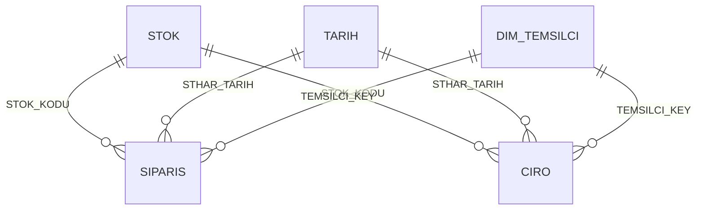

# Product & Mould Analysis

<p align="left">
  <b>🇬🇧 English</b> · <a href="README.md">🇹🇷 Türkçe</a> ·
  <a href="../README.en.md">← portfolio home</a>
</p>

A report that classifies the product catalogue to answer one question: which moulds deserve
investment and which should leave the portfolio. Moulds are ranked by cumulative revenue
share and each gets a **decision label** — core, new, dormant (raise the MOQ), dead
(candidate for removal). The high-volume core moulds became the shortlist for robotic
production; the long tail became the agenda for minimum-order-quantity negotiations.

This was the groundwork for a robot investment — a decision tool rather than a catalogue
view. Report labels are in Turkish, as in the original.


---

## What it answers

| Question | How |
|---|---|
| How many moulds make up 80% of revenue? | Cumulative revenue share per mould, with the boundary-crossing item included |
| Is this mould really dead, or still alive under a different shape? | The `BaskaSekilde` variable: last-12-month revenue of the same mould under other shapes |
| Are we mislabelling a newly opened mould as dormant? | If the first order is younger than 365 days → "New mould — monitor" |
| What is the average order quantity here? Does raising the MOQ make sense? | Average order quantity = total units ÷ order count |
| Can we change the shape/mould breakdown without touching the measures? | `AD1_Rapor` / `Kalip_Rapor` are the single point of change |

Decision labels: **Çekirdek** (core) · **Yeni Kalıp — İzle** (new, monitor) ·
**Atıl — MOQ Arttır** (dormant, raise MOQ) · **Ölü — Çıkarma Adayı** (dead, remove) ·
**Tek Kalıp — Ayrı Değerlendir** (single mould, judge separately)

---

## Pages

| Page | Content |
|---|---|
| **Kalıp** | Matrix over a shape → mould hierarchy: revenue, cumulative share, within-shape share, last-12-month revenue, order count, average order quantity and the decision label |
| **Baskılı - Kalıp** | The same matrix for the printed-from-stock business line, department filter swapped |
| **Sipariş Analizi** | Revenue and order-count lines by year, revenue cards per year |
| **153-118** | A hidden working page comparing two specific mould sizes |

---

## Screenshots

| | |
|---|---|
|  |  |
| **Baskılı - Kalıp** — printed-from-stock breakdown | **Sipariş Analizi** — revenue/orders by year |

---

## Data model

Small and purpose-built: two facts (`SIPARIS` for units, `CIRO` for value), one product
dimension and a calendar. The sales-rep dimension is derived from `CIRO` in DAX.



| Table | Note |
|---|---|
| `STOK` | Item master plus report-side derived columns: `KUTU_GRUBU`, `AD1_Rapor`, `AD1_New`, `KOD3_New`, `Kalip_Rapor` |
| `SIPARIS` | Order lines; source of the unit-based measures. `Satis Tipi` is derived from the document number (production / from stock / printed from stock) |
| `CIRO` | Invoice lines; source of the value-based measures |
| `TARIH` | 2012–2030 calendar (generated in pure M) |
| `DIM_TEMSILCI` | Calculated table from `DISTINCT(SELECTCOLUMNS(CIRO, ...))`; rows without a rep collapse into `"(Temsilcisiz)"` |

---

## Three details worth a look

**1 · Cumulative share that changes with the hierarchy level.** The matrix works at both
shape and mould level, and the denominator of the cumulative share has to change with it.
`ISINSCOPE` detects the level and picks the right `ALLSELECTED` scope — most granular branch
first:

```dax
OLC_CIRO_Kumulatif_Pay =
VAR MevcutCiro = [OLC_CIRO]
RETURN
IF( ISBLANK( MevcutCiro ), BLANK(),
    SWITCH( TRUE(),
        ISINSCOPE( STOK[Kalip_Rapor] ),          -- mould level: cumulative within the shape
        DIVIDE(
            SUMX( FILTER( ALLSELECTED( STOK[Kalip_Rapor] ), [OLC_CIRO] >= MevcutCiro ), [OLC_CIRO] ),
            CALCULATE( [OLC_CIRO], ALLSELECTED( STOK[Kalip_Rapor] ) ) ),
        ISINSCOPE( STOK[AD1_Rapor] ),            -- shape level: over the grand total
        DIVIDE(
            SUMX( FILTER( ALLSELECTED( STOK[AD1_Rapor] ), [OLC_CIRO] >= MevcutCiro ), [OLC_CIRO] ),
            CALCULATE( [OLC_CIRO], ALLSELECTED( STOK[AD1_Rapor] ) ) ) ) )
```

**2 · The decision measure rules out three false positives.** "Below 80% ⇒ core" is not
enough on its own:

- *Include the item that crosses the line* — the item's own share is subtracted before the
  threshold test, otherwise the item that pushes cumulative share past 80% is unfairly
  excluded.
- *Separate single-mould shapes* — if a shape has only one mould its cumulative share is
  always 100%, so it gets its own label.
- *Protect new moulds* — a mould whose first order is younger than 365 days is expected to
  have low volume; it is not called dormant.

```dax
OLC_Kalip_Karar =
VAR PayOncesi   = [OLC_CIRO_Kumulatif_Pay] - [OLC_CIRO_Sekil_Ici_Pay]
VAR Son12       = [OLC_CIRO_Son12Ay]
VAR IlkSiparis  = CALCULATE( MIN( SIPARIS[STHAR_TARIH] ), REMOVEFILTERS( TARIH ) )
VAR KalipSayisi = COUNTROWS( FILTER( ALLSELECTED( STOK[Kalip_Rapor] ), NOT ISBLANK( [OLC_CIRO] ) ) )
RETURN
SWITCH( TRUE(),
    KalipSayisi = 1,                                    "Tek Kalıp — Ayrı Değerlendir",
    IlkSiparis >= TODAY() - 365,                        "Yeni Kalıp — İzle",
    PayOncesi < 0.80,                                   "Çekirdek",
    ISBLANK( Son12 ) || Son12 = 0,                      "Ölü — Çıkarma Adayı",
                                                        "Atıl — MOQ Arttır" )
```

**3 · Measures read report columns, not raw ones.** The shape and mould breakdowns hang off
`AD1_Rapor` and `Kalip_Rapor`. That layer exists so a single edit fixes things when the
source disagrees with itself — the same mould filed under two shapes, or one box entered
under two codes. The catalogue in this repository is already unambiguous, so the columns
currently pass the raw values straight through; regrouping means editing here, not the measures.

---

## Data pipeline

A simplified SQL equivalent of the tables this report reads: [`../sql/`](../sql/)

---

## Running it

Open `Urun Kalip Analizi.pbip` in Power BI Desktop and hit **Refresh**.
Details in the [root README](../README.en.md#opening-the-reports).

> The decision measure uses `TODAY()`: the "last 12 months" and "new mould" thresholds are
> relative to the day you open the report. The synthetic data is generated around `--bugun`,
> so keeping the two on the same date keeps the labels meaningful.

