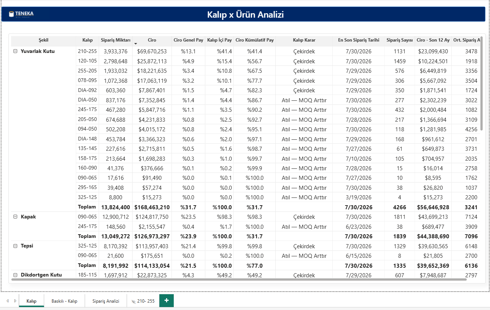
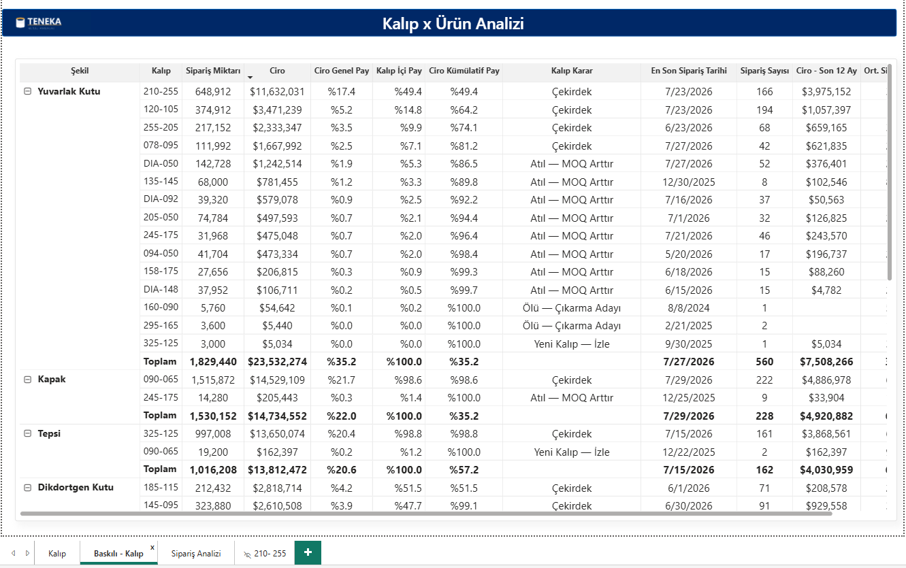
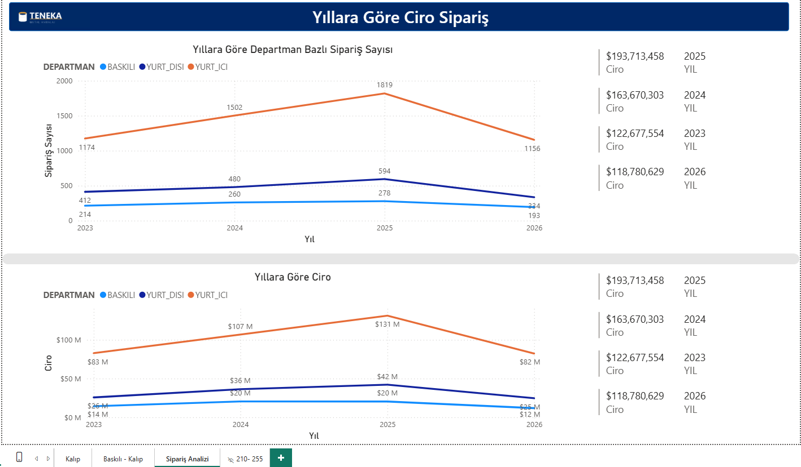
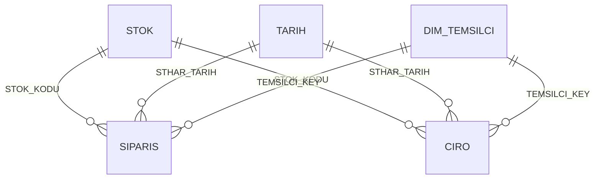

# Ürün & Kalıp Analizi

<p align="left">
  <a href="README.en.md">🇬🇧 English</a> · <b>🇹🇷 Türkçe</b> ·
  <a href="../README.md">← portföy ana sayfası</a>
</p>

Ürün kataloğunu "hangi kalıba yatırım yapılmalı, hangisi portföyden çıkmalı" sorusuna
cevap verecek şekilde sınıflandıran rapor. Kalıpları cironun kümülatif payına göre
sıralayıp her birine bir **karar etiketi** yazıyor: çekirdek, yeni, atıl (MOQ arttır),
ölü (çıkarma adayı). Yüksek hacimli çekirdek kalıplar robotlu üretime aday listesini,
kuyruktaki atıl kalıplar ise minimum sipariş miktarı görüşmelerinin gündemini oluşturuyor.

Bu, robot yatırımı için yapılan ön çalışmanın raporu — bir katalog görünümünden çok bir
karar aracı.



---

## Ne çözüyor

| Soru | Nasıl |
|---|---|
| Cironun %80'i kaç kalıptan çıkıyor? | Kalıp bazında kümülatif ciro payı; sınırı aşan kalem dahil edilerek |
| Bir kalıp gerçekten ölü mü, yoksa başka bir şekil altında canlı mı? | `BaskaSekilde` değişkeni: aynı kalıbın diğer şekillerdeki son 12 ay cirosu |
| Yeni açılan kalıbı yanlışlıkla "atıl" diye işaretlemiyor muyuz? | İlk sipariş tarihi 365 günden yeniyse "Yeni Kalıp — İzle" |
| Bu kalıpta ortalama sipariş adedi kaç? MOQ arttırmak mantıklı mı? | Ortalama sipariş adedi = toplam miktar ÷ sipariş sayısı |
| Şekil/kalıp kırılımını ölçüleri bozmadan değiştirebilir miyiz? | `AD1_Rapor` / `Kalip_Rapor` rapor kolonları tek değişim noktası |

Karar etiketleri: **Çekirdek** · **Yeni Kalıp — İzle** · **Atıl — MOQ Arttır** ·
**Ölü — Çıkarma Adayı** · **Tek Kalıp — Ayrı Değerlendir**

---

## Sayfalar

| Sayfa | İçerik |
|---|---|
| **Kalıp** | Şekil → kalıp hiyerarşisinde matris: ciro, kümülatif pay, şekil içi pay, son 12 ay cirosu, sipariş sayısı, ortalama sipariş adedi ve karar etiketi |
| **Baskılı - Kalıp** | Aynı matris, stoktan baskılı satış iş kolu için departman filtresi değiştirilmiş |
| **Sipariş Analizi** | Yıllara göre ciro ve sipariş sayısı çizgileri, yıl bazında ciro kartları |
| **153-118** | Belirli iki kalıp ölçüsünü karşılaştıran, gizli tutulan çalışma sayfası |

---

## Ekran görüntüleri

| | |
|---|---|
|  |  |
| **Baskılı - Kalıp** — stoktan baskılı satış kırılımı | **Sipariş Analizi** — yıllara göre ciro/sipariş |

---

## Veri modeli

Küçük ve amaca özel bir model: iki olgu (`SIPARIS` adet tarafı, `CIRO` tutar tarafı), tek
ürün boyutu ve bir takvim. Temsilci boyutu `CIRO`'dan DAX ile türetiliyor.



| Tablo | Not |
|---|---|
| `STOK` | Ürün kartı + rapor için türetilen kolonlar: `KUTU_GRUBU`, `AD1_Rapor`, `AD1_New`, `KOD3_New`, `Kalip_Rapor` |
| `SIPARIS` | Sipariş satırı; adet bazlı ölçülerin kaynağı. `Satis Tipi` fiş numarasından türetiliyor (üretim / stok satışı / baskılı stok satışı) |
| `CIRO` | Fatura satırı; tutar bazlı ölçülerin kaynağı |
| `TARIH` | 2012–2030 takvim (saf M ile üretilir) |
| `DIM_TEMSILCI` | `DISTINCT(SELECTCOLUMNS(CIRO, ...))` ile üretilmiş hesaplanmış tablo; temsilcisi boş satırlar `"(Temsilcisiz)"` olarak toplanıyor |

---

## Öne çıkan üç teknik ayrıntı

**1 · Hiyerarşi seviyesine göre değişen kümülatif pay.** Matris hem şekil hem kalıp
seviyesinde çalışıyor ve kümülatif payın paydası seviyeye göre değişiyor. `ISINSCOPE`
ile hangi seviyede olduğumuz tespit edilip doğru `ALLSELECTED` kapsamı seçiliyor —
en granüler dal en üstte:

```dax
OLC_CIRO_Kumulatif_Pay =
VAR MevcutCiro = [OLC_CIRO]
RETURN
IF( ISBLANK( MevcutCiro ), BLANK(),
    SWITCH( TRUE(),
        ISINSCOPE( STOK[Kalip_Rapor] ),          -- kalıp seviyesi: şekil içi kümülatif
        DIVIDE(
            SUMX( FILTER( ALLSELECTED( STOK[Kalip_Rapor] ), [OLC_CIRO] >= MevcutCiro ), [OLC_CIRO] ),
            CALCULATE( [OLC_CIRO], ALLSELECTED( STOK[Kalip_Rapor] ) ) ),
        ISINSCOPE( STOK[AD1_Rapor] ),            -- şekil seviyesi: genel toplam üzerinden
        DIVIDE(
            SUMX( FILTER( ALLSELECTED( STOK[AD1_Rapor] ), [OLC_CIRO] >= MevcutCiro ), [OLC_CIRO] ),
            CALCULATE( [OLC_CIRO], ALLSELECTED( STOK[AD1_Rapor] ) ) ) ) )
```

**2 · Karar ölçüsü üç ayrı yanlış pozitifi eliyor.** Sadece "%80'in altındaysa çekirdek"
demek yetmiyor:

- *Sınırı aşan kalem dahil edilir* — kümülatif paydan kalemin kendi payı çıkarılıp
  eşik ona göre kontrol edilir, yoksa %80'i tam aşan kalem haksızca dışarıda kalır.
- *Tek kalıplı şekiller ayrılır* — bir şekilde tek kalıp varsa kümülatif pay her zaman
  %100 çıkar, bu yüzden ayrı etiketlenir.
- *Yeni kalıplar korunur* — ilk siparişi 365 günden yeniyse henüz hacim yapmamış olması
  normaldir, "atıl" denmez.

```dax
OLC_Kalip_Karar =
VAR PayOncesi   = [OLC_CIRO_Kumulatif_Pay] - [OLC_CIRO_Sekil_Ici_Pay]
VAR Son12       = [OLC_CIRO_Son12Ay]
VAR IlkSiparis  = CALCULATE( MIN( SIPARIS[STHAR_TARIH] ), REMOVEFILTERS( TARIH ) )
VAR KalipSayisi = COUNTROWS( FILTER( ALLSELECTED( STOK[Kalip_Rapor] ), NOT ISBLANK( [OLC_CIRO] ) ) )
RETURN
SWITCH( TRUE(),
    KalipSayisi = 1,                                    "Tek Kalıp — Ayrı Değerlendir",
    IlkSiparis >= TODAY() - 365,                        "Yeni Kalıp — İzle",
    PayOncesi < 0.80,                                   "Çekirdek",
    ISBLANK( Son12 ) || Son12 = 0,                      "Ölü — Çıkarma Adayı",
                                                        "Atıl — MOQ Arttır" )
```

**3 · Ölçüler ham kolon yerine rapor kolonu üzerinden çalışıyor.** Şekil ve kalıp
kırılımları `AD1_Rapor` ve `Kalip_Rapor` kolonlarına bağlı. Bu katman, kaynak veride
kalıp ile şekil uyuşmadığında ya da aynı kutu iki kodla girildiğinde düzeltmeyi tek
yerde yapmak için var; bu depodaki katalog tekil olduğu için şu an ham kolonu aynen
geçiriyor. Kırılımı değiştirmek gerekirse ölçülere dokunmadan burası düzenlenir.

---

## Veri hattı

Raporun okuduğu tabloların sadeleştirilmiş SQL karşılığı: [`../sql/`](../sql/)

---

## Nasıl açılır

`Urun Kalip Analizi.pbip` dosyasını Power BI Desktop ile açın, **Yenile**'ye basın.
Ayrıntı: [ana README](../README.md#nasıl-açılır).

> Karar ölçüsü `TODAY()` kullanıyor: "son 12 ay" ve "yeni kalıp" eşikleri raporu açtığınız
> güne göre hesaplanır. Sentetik veri de `--bugun` parametresine göre üretildiği için
> ikisini aynı tarihte tutmak etiketleri anlamlı kılar.

